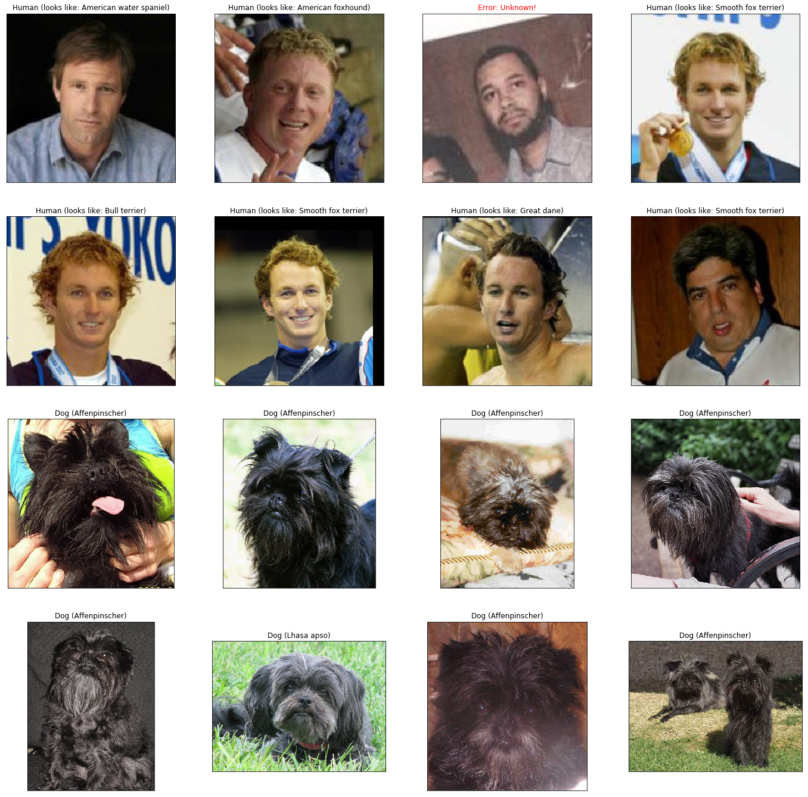

# Udacity Deep Learning Nanodegree

## Dog-Breed Classifier

Design and train a convolutional neural network to analyze images of dogs and correctly identify their breeds. Use transfer learning and well-known architectures to improve this model.



### Requirements

1. Download and install [Anaconda Python](http://www.anaconda.com)
2. Create and activate a [Conda environment](http://docs.conda.io/projects/conda/en/latest/user-guide/tasks/manage-environments.html)
3. Download the [dog dataset](http://s3-us-west-1.amazonaws.com/udacity-aind/dog-project/dogImages.zip); unzip the folder and place it in the repository at `dogs_dir`
4. Download the [human dataset](http://vis-www.cs.umass.edu/lfw/lfw.tgz); unzip the folder and place it in the repository at `lfw_dir`
5. Install PyTorch and torchvision
```
conda install pytorch torchvision -c pytorch
```

### Set-up

Clone the project repository
```
git clone http://github.com/gdonatti/nd101-project-dog-classification.git
```

Install required Python packages
```
cd nd101-project-dog-classification
conda install --file requirements.txt
```

Launch the project Jupyter Notebook
```
jupyter notebook dog_app.ipynb
```

### License

This project is licensed under the [MIT License](LICENSE)

### Acknowledgments

Udacity [Deep Learning Nanodegree](http://github.com/udacity/deep-learning-v2-pytorch)